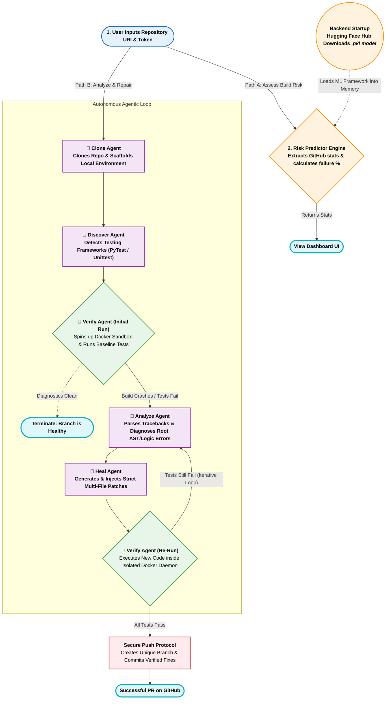

# 🛡️ Aegis: Autonomous CI/CD Pipeline

> An enterprise-grade, ML-powered autonomous system designed to proactively predict build failures, diagnose runtime crashes, and flawlessly self-heal codebases in isolated Sandbox environments.

---

## 🔍 Why Aegis?

**This is not a traditional pipeline.** Broken builds are one of the most expensive and time-consuming bottlenecks in modern software engineering. 

In enterprise CI/CD, every failure triggers a manual debugging cycle that requires an engineer to:
1. **Analyze logs** — Sift through thousands of lines of output to trace a stack error.
2. **Reproduce the bug** — Attempt to recreate the broken state locally.
3. **Draft a patch** — Apply syntax or logic updates.
4. **Resubmit to CI** — Wait for another integration cycle.

**Aegis** completely disrupts this workflow by embedding an interactive multi-agent reinforcement loop into the CI/CD pipeline itself. Aegis acts as a virtual Principal Engineer — intercepting the failed commit, actively reading the codebase, reasoning over test failures, and pushing verified structural patches back to the branch.

> [!IMPORTANT]  
> Aegis is architected for production-level reliability. It utilizes isolated Docker execution protocols, strict abstract syntax tree (AST) verifications, and deterministic LLM strategies to guarantee patches do not introduce new regressions.

---

## 🚀 Running the Healing Pipeline

Experience the ultimate self-healing demo live across any repository:

```bash
# Start the backend pipeline engine
cd backend
python main.py

# Start the interactive UI
cd frontend
npm run dev
```

Watch the pipeline operate across three distinct intelligence domains:

| Module | Sub-Agent | What It Demonstrates |
| :--- | :--- | :--- |
| **1 — Static Analyzer** | `Analyze_Agent` | Precise Error bubbing, pinpointing Syntactical and Runtime failures without human intervention. |
| **2 — Code Healer** | `Heal_Agent` | Deterministic application of localized code modifications spanning multiple deeply nested files. |
| **3 — Sandbox Verifier** | `Verify_Agent` | Containerized test-suite execution ensuring zero-trust patching before merging. |

> **No mocks. No hardcoded logic.** Every fix is verified against actual testing schemas using live in-memory execution streams.

---

## 📖 Architecture Overview

Aegis relies on a dynamic **Triad Architecture**, guaranteeing immense machine learning processing power can be paired seamlessly with serverless environments.

**Key Architectural Features:**

| Feature | Implementation |
| :--- | :--- |
| **Serverless Triad** | Vercel (Frontend Component), Render (Backend Agent Service), and Hugging Face (Model Delivery). |
| **ML Predictive Engine** | Automatically calculates failure probabilities using a Random Forest model trained on 1.5 million historic build logs. |
| **Dynamic AST Injection** | Generates verified Python `__CROSSFILE__` injection instructions for strict logical repairs. |
| **Zero-Trust Dockering** | Executes all unverified code inside a lightweight ephemeral Docker sandbox container. |
| **SSE Streaming** | Live-streams the AI Agent's internal thought process back to the React UI using Server-Sent Events. |

---

## 🛠️ Tech Stack

**Frontend**
- React 19, Vite, TailwindCSS 4, Zustand, Framer Motion, Recharts

**Backend & AI**
- Python 3.12, FastAPI, CrewAI, Google Gemini 2.0 Flash
- Hugging Face Hub (Model distribution)

**Machine Learning**
- Scikit-learn, Pandas, Joblib
- Trained on `TravisTorrent 2017` CI/CD data
- **Model Training Notebook**: See `Aegis_Model_Training.ipynb` in the root repository. It contains the complete data extrapolation pipeline and structural training logic used to generate the live `.pkl` model.

---

## 🏗️ Autonomous Healing Architecture

Aegis utilizes a robust, unidirectional verification loop (`backend/crew_orchestrator.py`) handling all edge cases:



---

## 📊 Interaction Protocols

### Risk Prediction Vector

Aegis analyzes GitHub history instantly via the `GitHubStatsProcessor`:

| Metric | Type | Description |
| :--- | :--- | :--- |
| `git_diff_src_churn` | `int` | Total volatility and churn of source files |
| `gh_team_size` | `int` | Number of concurrent contributors |
| `gh_sloc` | `int` | Size and complexity of the current codebase |

### Healing Constraints

| Penalty / Guardrail | Logic | Condition |
| :--- | :--- | :--- |
| Sandbox Timeout | Aborted | Halts runaway code that exceeds 120 seconds |
| Branch Protection | Hard Block | Automatically rejects AI pushes targeting `main` or `master` |

---

## 🗄️ Constraints & Infrastructure Limitations

1. **Serverless Cold Starts**: When hosted on serverless tiers (like Render), inactive backends hibernate after 15 minutes. **The initial request to the pipeline may take 30-60 seconds** as the server awakens and downloads the heavy ML Model from Hugging Face.
2. **Cloud Docker Limitations**: The `Verify_Agent` relies securely on local Docker DAEMON instances. Native serverless platforms block "Docker-in-Docker" execution. Live demos typically run static fallback assessments unless connected to a dedicated VM.

---

## 🚀 Getting Started

### Prerequisites

- Node.js 18+
- Python 3.12+
- Google Gemini API Key

### 1. Repository Setup

```bash
git clone https://github.com/AshrafGalaxy/Machine_Learning.git
cd Machine_Learning
```

### 2. Launching the Backend

The Aegis backend intercepts commands and pulls the required models.

```bash
cd backend
python -m venv venv
# Windows: venv\Scripts\activate | Unix: source venv/bin/activate

pip install -r requirements.txt
cp .env.example .env 
# Add your GEMINI_API_KEY into .env

python main.py
```
*API available instantly at `http://localhost:8000`*

### 3. Frontend Development
```bash
cd frontend
npm install
npm run dev
```
*UI available at http://localhost:5173*


### 4. Local Sandbox Testing
To cleanly observe the AI's zero-trust patching process without mutating your active project files, use the included `test_sandbox` directory.
1. Run the backend and frontend as usual.
2. Select the `test_sandbox` paths or files when executing verification loops instead of production source code.
3. The AI Verify_Agent and Heal_Agent will use this isolated directory to safely mock crashes, parse AST structures, and draft test-suite fixes natively without risking your primary codebase.

---

## 📁 Core Directory Structure

```text
Machine_Learning/
├── .github/workflows/      # Automated Github Action runners
├── .gitignore              # Secures sensitive keys and ignores massive data artifacts
├── docker-compose.yml      # Orchestrates backend & frontend containerization environments
├── Dockerfile.sandbox      # The ephemeral Docker blueprint for the zero-trust code execution
├── render.yaml             # Render deployment infrastructure configuration
├── Aegis_Model_Training.ipynb # Full data manipulation pipeline used to train the HF Random Forest model
├── README.md               # Master comprehensive architectural documentation
│
├── backend/                # FASTAPI ENGINE & MULTI-AGENT INFERENCE
│   ├── main.py             # Express API router & HuggingFace Model fetcher/loader
│   ├── crew_orchestrator.py# Directed Agent workflow orchestrator
│   ├── config.py           # Strictly enforced system constraints and sandbox definitions
│   ├── models.py           # Pydantic schemas protecting input/output and SSE stream integrity
│   ├── requirements.txt    # Frozen pip dependencies
│   ├── .env.example        # Environment layout blueprint (requires GEMINI_API_KEY)
│   ├── sse_manager.py      # Real-time WebSocket connection manager streaming AI thought logs
│   ├── utils.py            # Centralized structural path formatters and parsers
│   │
│   ├── agents/             # DYNAMIC INTELLIGENCE PROTOCOLS
│   │   ├── analyze_agent.py# Regex and log auditor diagnosing precise crash logic
│   │   ├── clone_agent.py  # Repository caching and local branch environment scaffold
│   │   ├── discover_agent.py # PyTest/Unittest/Tox dynamic framework discovery
│   │   ├── heal_agent.py   # Code generation module executing strict structural patches
│   │   └── verify_agent.py # Invokes Docker payload tests iteratively until passing
│   │
│   └── services/           # BRIDGE INFRASTRUCTURE
│       ├── docker_service.py # Interacts securely with local Daemon to run tests ephemerally
│       ├── git_service.py    # Native push protocol injecting user-session GitHub tokens
│       ├── github_service.py # Pulls repo churn records for machine-learning scoring algorithm
│       └── results_service.py# Finalizes JSON logging of the healing event
│
├── frontend/               # VITE + REACT DASHBOARD
│   ├── index.html          # Web application entry DOM
│   ├── package.json        # Node.js ecosystem and script definitions
│   ├── vite.config.js      # Zero-config Vite module bundler definitions
│   ├── eslint.config.js    # Strict ESLint standard configurations
│   ├── src/
│   │   ├── App.jsx         # Primary router assigning structural pathways
│   │   ├── main.jsx        # Highest-level React DOM renderer
│   │   ├── index.css       # Fully customized CSS utility pipeline
│   │   │
│   │   ├── pages/          
│   │   │   └── LandingPage.jsx  # Hero layout encompassing the ML Assessment Dashboard & Input components
│   │   │
│   │   ├── store/
│   │   │   └── useAgentStore.js # Critical Zustand Global Store orchestrating async pipeline flows
│   │   │
│   │   ├── lib/
│   │   │   ├── firebase.js      # Authentication and database link handler
│   │   │   └── utils.js         # Shadcn tailwind-merge utility functions
│   │   │
│   │   ├── components/     # CUSTOM DESIGNED REACT ARCHITECTURE
│   │   │   ├── HeroInput.jsx    # Primary repository ingestion and token passing interface
│   │   │   ├── ScoreBreakdown.jsx # Real-time visualization of ML Risk Predictor drivers
│   │   │   ├── RunSummary.jsx   # Top-level failure probability and risk assessment visualizer
│   │   │   ├── ActivityLog.jsx  # Streams localized thought behaviors from the CrewAI agents
│   │   │   ├── CICDTimeline.jsx # Graphical node-based visualization of the pipeline status layout
│   │   │   ├── FixesTable.jsx   # Dynamic grid enumerating lines updated and logical differences
│   │   │   ├── Skeletons.jsx    # Pulsing dark-mode rendering fallbacks used during API latency states
│   │   │   ├── Navbar.jsx       # Top-level navigator featuring Firebase Auth elements
│   │   │   └── Footer.jsx       # Project attribution details
│   │   │
│   │   └── components/v0_ui/ # REUSABLE DESIGN SYSTEMS (Shadcn Core)
│   │       ├── dashboard-section.jsx # Section wrapper for dashboard layouts
│   │       ├── features-section.jsx  # Section wrapper highlighting platform features
│   │       ├── theme-provider.jsx    # Handles dark-mode contexts natively
│   │       └── ui/             # PRIMITIVE ATOMIC SHELLS
│   │           ├── ...         # (accordion, button, card, chart, form, input, toast, etc.)
│   │
└── test_sandbox/           # ZERO-TRUST TARGET ENVIRONMENT
    ├── requirements.txt    # Defines fake sandbox libraries
    │
    ├── src/
    │   ├── math_logic.py   # Flawed target code designed to be autonomously evaluated and fixed by Aegis
    │   └── parser.py       # Additional flawed python parsing target
    │
    └── tests/
        ├── test_math_logic.py # Explicit Unittest file invoking broken arithmetic
        └── test_parser.py     # Explicit Unittest invoking misconfigured imports
```
