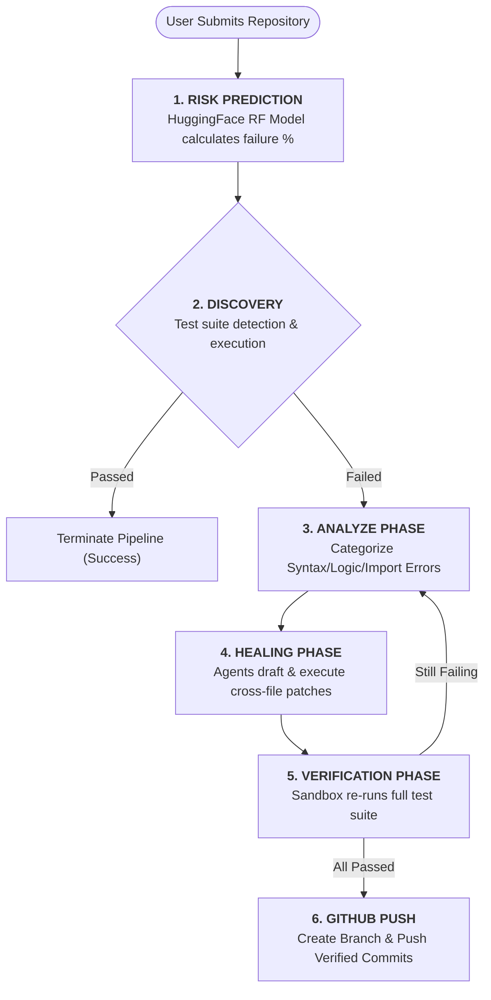

# 🛡️ Aegis: Autonomous CI/CD Pipeline

> An enterprise-grade, ML-powered autonomous system designed to proactively predict build failures, diagnose runtime crashes, and flawlessly self-heal codebases in isolated Sandbox environments.

---

## 🔍 Why Aegis?

**This is not a traditional pipeline.** Broken builds are one of the most expensive and time-consuming bottlenecks in modern software engineering. 

In enterprise CI/CD, every failure triggers a manual debugging cycle that requires an engineer to:
1. **Analyze logs** — Sift through thousands of lines of output to trace a stack error.
2. **Reproduce the bug** — Attempt to recreate the broken state locally.
3. **Draft a patch** — Apply syntax or logic updates.
4. **Resubmit to CI** — Wait for another integration cycle.

**Aegis** completely disrupts this workflow by embedding an interactive multi-agent reinforcement loop into the CI/CD pipeline itself. Aegis acts as a virtual Principal Engineer — intercepting the failed commit, actively reading the codebase, reasoning over test failures, and pushing verified structural patches back to the branch.

> [!IMPORTANT]  
> Aegis is architected for production-level reliability. It utilizes isolated Docker execution protocols, strict abstract syntax tree (AST) verifications, and deterministic LLM strategies to guarantee patches do not introduce new regressions.

---

## 🚀 Running the Healing Pipeline

Experience the ultimate self-healing demo live across any repository:

```bash
# Start the backend pipeline engine
cd backend
python main.py

# Start the interactive UI
cd frontend
npm run dev
```

Watch the pipeline operate across three distinct intelligence domains:

| Module | Sub-Agent | What It Demonstrates |
| :--- | :--- | :--- |
| **1 — Static Analyzer** | `Analyze_Agent` | Precise Error bubbing, pinpointing Syntactical and Runtime failures without human intervention. |
| **2 — Code Healer** | `Heal_Agent` | Deterministic application of localized code modifications spanning multiple deeply nested files. |
| **3 — Sandbox Verifier** | `Verify_Agent` | Containerized test-suite execution ensuring zero-trust patching before merging. |

> **No mocks. No hardcoded logic.** Every fix is verified against actual testing schemas using live in-memory execution streams.

---

## 📖 Architecture Overview

Aegis relies on a dynamic **Triad Architecture**, guaranteeing immense machine learning processing power can be paired seamlessly with serverless environments.

**Key Architectural Features:**

| Feature | Implementation |
| :--- | :--- |
| **Serverless Triad** | Vercel (Frontend Component), Render (Backend Agent Service), and Hugging Face (Model Delivery). |
| **ML Predictive Engine** | Automatically calculates failure probabilities using a Random Forest model trained on 1.5 million historic build logs. |
| **Dynamic AST Injection** | Generates verified Python `__CROSSFILE__` injection instructions for strict logical repairs. |
| **Zero-Trust Dockering** | Executes all unverified code inside a lightweight ephemeral Docker sandbox container. |
| **SSE Streaming** | Live-streams the AI Agent's internal thought process back to the React UI using Server-Sent Events. |

---

## 🛠️ Tech Stack

**Frontend**
- React 19, Vite, TailwindCSS 4, Zustand, Framer Motion, Recharts

**Backend & AI**
- Python 3.12, FastAPI, CrewAI, Google Gemini 2.0 Flash
- Hugging Face Hub (Model distribution)

**Machine Learning**
- Scikit-learn, Pandas, Joblib
- Trained on `TravisTorrent 2017` CI/CD data
- **Model Training Notebook**: See `Aegis_Model_Training.ipynb` in the root repository. It contains the complete data extrapolation pipeline and structural training logic used to generate the live `.pkl` model.

---

## 🏗️ Autonomous Healing Architecture

Aegis utilizes a robust, unidirectional verification loop (`backend/crew_orchestrator.py`) handling all edge cases:



---

## 📊 Interaction Protocols

### Risk Prediction Vector

Aegis analyzes GitHub history instantly via the `GitHubStatsProcessor`:

| Metric | Type | Description |
| :--- | :--- | :--- |
| `git_diff_src_churn` | `int` | Total volatility and churn of source files |
| `gh_team_size` | `int` | Number of concurrent contributors |
| `gh_sloc` | `int` | Size and complexity of the current codebase |

### Healing Constraints

| Penalty / Guardrail | Logic | Condition |
| :--- | :--- | :--- |
| Sandbox Timeout | Aborted | Halts runaway code that exceeds 120 seconds |
| Branch Protection | Hard Block | Automatically rejects AI pushes targeting `main` or `master` |

---

## 🗄️ Constraints & Infrastructure Limitations

1. **Serverless Cold Starts**: When hosted on serverless tiers (like Render), inactive backends hibernate after 15 minutes. **The initial request to the pipeline may take 30-60 seconds** as the server awakens and downloads the heavy ML Model from Hugging Face.
2. **Cloud Docker Limitations**: The `Verify_Agent` relies securely on local Docker DAEMON instances. Native serverless platforms block "Docker-in-Docker" execution. Live demos typically run static fallback assessments unless connected to a dedicated VM.

---

## 🚀 Getting Started

### Prerequisites

- Node.js 18+
- Python 3.12+
- Google Gemini API Key

### 1. Repository Setup

```bash
git clone https://github.com/AshrafGalaxy/Machine_Learning.git
cd Machine_Learning
```

### 2. Launching the Backend

The Aegis backend intercepts commands and pulls the required models.

```bash
cd backend
python -m venv venv
# Windows: venv\Scripts\activate | Unix: source venv/bin/activate

pip install -r requirements.txt
cp .env.example .env 
# Add your GEMINI_API_KEY into .env

python main.py
```
*API available instantly at `http://localhost:8000`*

### 3. Frontend Development
```bash
cd frontend
npm install
npm run dev
```
*UI available at http://localhost:5173*


### 4. Local Sandbox Testing
To cleanly observe the AI's zero-trust patching process without mutating your active project files, use the included `test_sandbox` directory.
1. Run the backend and frontend as usual.
2. Select the `test_sandbox` paths or files when executing verification loops instead of production source code.
3. The AI Verify_Agent and Heal_Agent will use this isolated directory to safely mock crashes, parse AST structures, and draft test-suite fixes natively without risking your primary codebase.

---

## 📁 Core Directory Structure

```
Machine_Learning/
├── README.md               # Architecture documentation
├── backend/
│   ├── main.py             # FastAPI Server & Model Loading logic
│   ├── crew_orchestrator.py # Multi-Agent sequential loop logic
│   ├── config.py           # Infrastructure strict constants
│   ├── models.py           # Pydantic schemas protecting I/O integrity
│   ├── services/
│   │   ├── git_service.py  # Zero-trust GitHub integration & push validation
│   │   └── github_service.py # Feature extraction for the ML model
│   └── agents/             
│       ├── analyze_agent.py # Bug categorization protocols
│       └── heal_agent.py   # AST and patching protocols
└── frontend/
    ├── src/
    │   ├── store/          # Zustand global state (Agent Stream Handlers)
    │   └── components/     # Framer Motion animated metrics and dashboards
    └── index.css           # Tokenized utility styles
```
